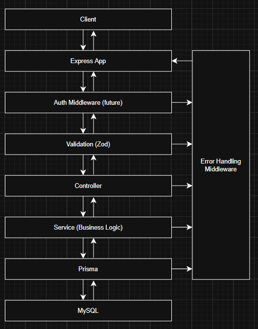
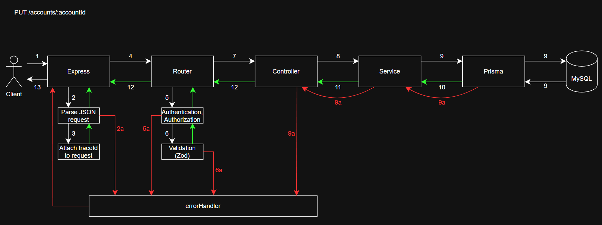

# MiniBankAPI

## Project Spec

[Project Spec](docs/NodeJS%20Project.pdf) (found in `/docs/NodeJS Project.pdf`)

## Project Setup

After pulling:
```
npm install
npx prisma generate
```

Note: Make sure you have your copy of `.env` file in the project root (see [`/.env.example`](.env.example)).

To start server:
```
npm run dev
```

To run tests, run one of the following:
```
npx jest
npx jest <path_to_test_module>
npx jest --coverage
```

To run ONLY unit tests (--coverage flag optional):
```
cd <project_root>
npx jest tests/unit --coverage
```

To see swagger documentation, first start the server. Then, paste this in your browser:
```
http://localhost:3000/docs/
```

## API Endpoints

### Health

#### GET /health

Returns service health status

---

### Authentication

#### POST /auth/register

Register a new user

#### POST /auth/login

Log in registered user

#### POST /auth/logout

Log out user

#### GET /auth/me

Get user summary

---

### Accounts

#### POST /accounts

Create a new account

#### GET /accounts

List accounts for a customer

#### GET /accounts/:id

Get account by ID

#### PUT /accounts/:id

Update account (allowed fields only)

#### POST /accounts/:id/close

Close account

#### GET /accounts/:id/summary

Get account summary

---

### Transactions

#### POST /accounts/:accountId/transactions

Start a new DEBIT or CREDIT transaction

#### GET /accounts/:accountId/transactions?limit=...&offset=...&type=...&from=...&to=...

List transactions for a given account

#### GET /accounts/:accountId/transactions/:transactionId

Get a single transaction record for a given account

---

### Transfers

#### POST /accounts/:accountId/transfers

Start a new transfer between 2 accounts

#### GET /accounts/:accountId/transfers?limit=...&offset=...&from=...&to=...

List transfers for a given account

#### GET /accounts/:accountId/transfers/:transactionId

Get a single transfer record for a given account

## Authorization

### Auth Domain

| Endpoint                 | ADMIN   | STANDARD | UNAUTHENTICATED |
| --------                 | ------- | -------- | --------------- |
| POST /auth/register      | N/A | N/A | ✅ |
| POST /auth/login         | N/A | N/A | ✅ |
| POST /auth/logout        | ✅ | ✅ | ❌ |
| GET /auth/me             | ✅ | ✅ | ❌ |

### Accounts Domain

| Endpoint                  | ADMIN   | STANDARD | UNAUTHENTICATED |
| --------                  | ------- | -------- | ----------- |
| POST /accounts            | ✅ | ✅ | ❌ |
| GET /accounts             | ✅ | ✅ | ❌ |
| GET /accounts/:id         | ✅ (ANY Account) | ✅ | ❌ |
| PUT /accounts/:id         | ✅ (ANY Account) | ✅ | ❌ |
| POST /accounts/:id/close  | ✅ (ANY Account) | ✅ | ❌ |
| GET /accounts/:id/summary | ✅ (ANY Account) | ✅ | ❌ |

### Transactions Domain

| Endpoint                             | ADMIN   | STANDARD | UNAUTHENTICATED |
| --------                             | ------- | -------- | --------------- |
| POST /.../transactions               | ✅ (ANY Account) | ✅ | ❌ |
| GET /.../transactions                | ✅ (ANY Account) | ✅ | ❌ |
| GET /.../transactions/:transactionId | ✅ (ANY Account) | ✅ | ❌ |

### Transfers Domain

| Endpoint                       | ADMIN   | STANDARD | UNAUTHENTICATED |
| --------                       | ------- | -------- | --------------- |
| POST /.../transfers            | ✅ (ANY Account) | ✅ | ❌ |
| GET /.../transfers             | ✅ (ANY Account) | ✅ | ❌ |
| GET /.../transfers/:transferId | ✅ (ANY Account) | ✅ | ❌ |

## Overview Diagrams

### High-Level Request Lifecycle



### Detailed Flow For PUT /accounts/:accountId



1. Client sends `PUT /accounts/:accountId` to express server
1. Express parses json request 
    1. If parsing fails --> throw 400 --> errorHandler
1. Express attaches trace ID to request
1. Router matches `PUT /accounts/:accountId`
1. Auth middleware validates token (if enabled)
    1.  If invalid --> throw `401` --> errorHandler
1. Zod validates `req.params.accountId` and `req.body` based on schema
    1. If invalid --> throw `400` --> errorHandler
1. Controller is called and extracts `accountId` and validates body fields
1. Controller calls `service.updateAccountById(accountId, body)`
1. Service invokes prisma to send UPDATE query to MySQL
    1. Record does not exist --> Prisma throws --> Error bubbles up to errorHandler --> errorHandler throws `404`
1. Prisma returns updated account to service
1. Service returns updated account to controller
1. Controller sends status `200` and JSON response
1. Express sends response to client

## Postman Collection

Postman files are located in:

```
postman/
```

### Files

- `epic1.json`
- `local_env.json`

### How to Import

1. Open Postman
2. Click **Import**
3. Import both:
   - Collection file
   - Environment file
4. Select environment: **MiniBankAPI - Local**